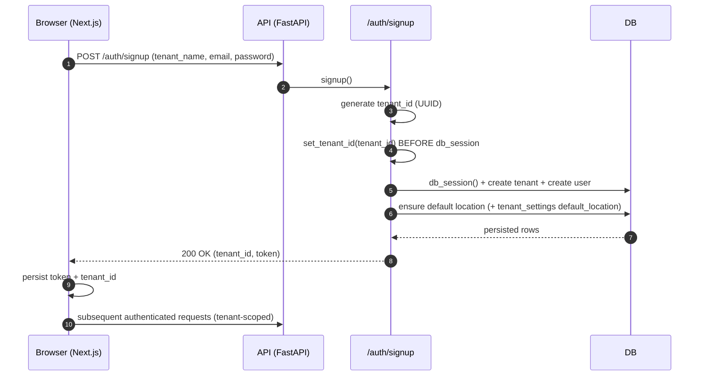
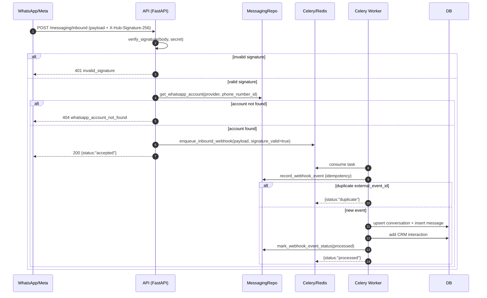
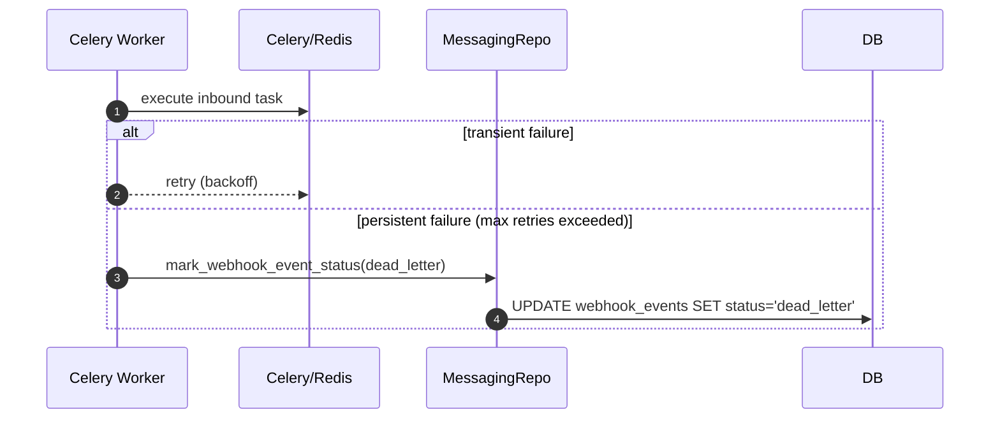

# Data Flow Diagrams — Core Workflows (Beauty CRM)

Data: **2026-04-09**  
Audience: **Engenharia / Produto / Ops**

> Diagramas em Mermaid para facilitar revisão e onboarding.

## 1) Authenticated dashboard request (tenant-scoped)

```mermaid
sequenceDiagram
  autonumber
  participant Browser as Browser (Next.js)
  participant API as API (FastAPI)
  participant MW as Tenancy middleware
  participant Deps as Auth deps (require_user)
  participant DB as DB (Postgres/SQLite)

  Browser->>API: GET /crm/customers + X-Tenant-ID + Bearer token
  API->>MW: tenancy_middleware
  MW->>MW: set_tenant_id(tenant_id)
  API->>Deps: require_user()
  Deps->>Deps: verify_token() + tenant_mismatch check
  API->>DB: db_session() (set_config app.current_tenant_id)
  DB-->>API: tenant-scoped rows (RLS and/or filters)
  API-->>Browser: 200 OK (data)
  MW->>MW: clear_tenant_id(); clear_current_user_id()
```

## 2) Signup flow (new workspace)



## 3) Inbound WhatsApp webhook (signature → routing → queue → processing)



### Failure path: retries and DLQ



## 4) Notes (assumptions and validations)

- O fluxo inbound assume que o lookup de `whatsapp_accounts` é possível sem tenant context; isso precisa ser validado sob RLS (ver auditoria).
- Em ambiente local, é necessário Redis + worker rodando para simular produção (compose atual não inclui).

