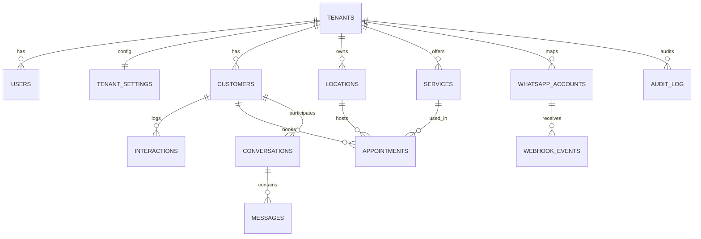

# Domain Model — Entity Map (Beauty CRM)

Data: **2026-04-09**  
Audience: **Engenharia / Produto / Data**

## 1) Objetivo

Este documento consolida o **modelo de domínio “as-is”**, com entidades centrais, relacionamentos e observações relevantes para:
- onboarding
- migrações e constraints
- auditoria de tenancy/RLS
- rastreabilidade (rotas ↔ entidades)

## 2) Entidades (alto nível)

### Núcleo multi-tenant
- **Tenant** (`tenants`)
  - representa o workspace/conta.
- **User** (`users`)
  - pertence a um tenant; e-mail é único por tenant.
- **TenantSettings** (`tenant_settings`)
  - configurações do workspace (timezone, moeda, default location, branding).

### CRM e operação
- **Customer** (`customers`)
  - pertence a um tenant; `phone` e `email` são únicos por tenant quando presentes.
- **Interaction** (`interactions`)
  - pertence a tenant e customer; payload modelado como JSON.
- **Location** (`locations`)
  - unidade/local do tenant; controla política de overlap em appointments.
- **Service** (`services`)
  - catálogo do tenant.
- **Appointment** (`appointments`)
  - agendamento; liga customer, service (opcional) e location.

### Messaging (WhatsApp)
- **WhatsAppAccount** (`whatsapp_accounts`)
  - mapeia `provider + phone_number_id` → tenant.
- **WebhookEvent** (`webhook_events`)
  - idempotência por `(tenant_id, provider, external_event_id)`.
- **Conversation** (`conversations`)
  - por customer + channel.
- **Message** (`messages`)
  - por conversation; dedupe por `(tenant_id, provider_message_id)`.

### Auditoria
- **AuditLog** (`audit_log`)
  - trilha before/after para alterações relevantes.

## 3) Diagrama ER (Mermaid)

## 4) Constraints e invariantes relevantes (as-is)

### Unicidade e idempotência (Confirmado)
- `users`: unique `(tenant_id, email)` (ORM: `modules/iam/models/user_orm.py`)
- `customers`: unique `(tenant_id, phone)` e `(tenant_id, email)` (ORM: `modules/crm/models/customer_orm.py`)
- `whatsapp_accounts`: unique `(provider, phone_number_id)` (migration: `alembic/versions/0e7c0b3f3b9c_add_messaging_tables_and_rls.py`)
- `webhook_events`: unique `(tenant_id, provider, external_event_id)` (ORM/migration)
- `messages`: unique `(tenant_id, provider_message_id)` (migration e ORM)
- `conversations`: unique `(tenant_id, customer_id, channel)` (migration e ORM)

### Tenancy e RLS (Confirmado / Precisa validação em runtime)
- Há migrations habilitando RLS/policies em diversas tabelas e o DB session seta `app.current_tenant_id`.
- **Risco estrutural:** `whatsapp_accounts` sob RLS pode impedir lookup de roteamento no inbound webhook (ver auditoria técnica).

## 5) Onde isso aparece no produto (entrada rápida)

- Signup cria `tenants`, `users`, `locations` e `tenant_settings` (diretamente ou por “ensure default”).
- CRM cria/atualiza `customers`, `interactions`, `services`, `appointments`, `locations`.
- Messaging inbound cria `webhook_events`, `conversations`, `messages` e também `interactions`.
- Audit log é escrito por repos de CRM e outros pontos.

## 6) Referências

- Pack index: `docs/audit/README.md`
- Auditoria técnica: `docs/audit/2026-04-09-technical-audit.md`
- Matriz de rastreabilidade: `docs/audit/2026-04-09-traceability-matrix.md`

